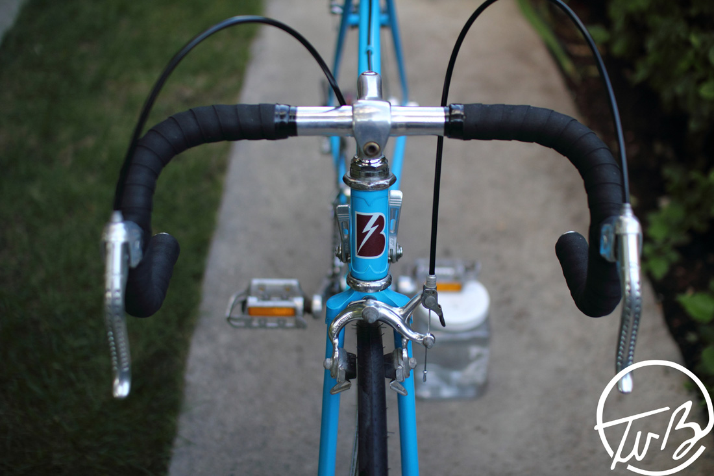
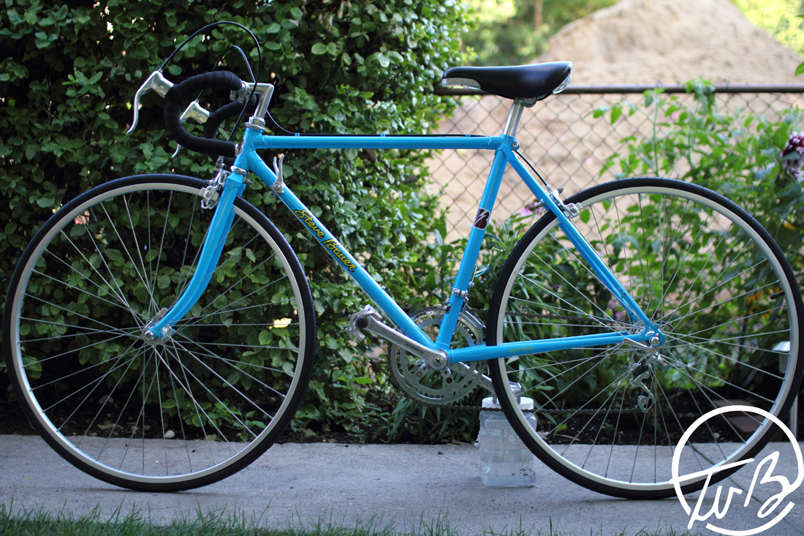
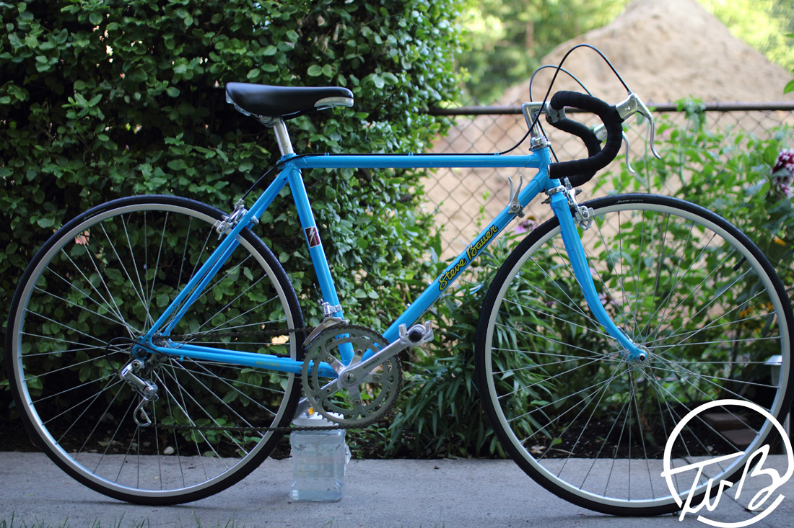
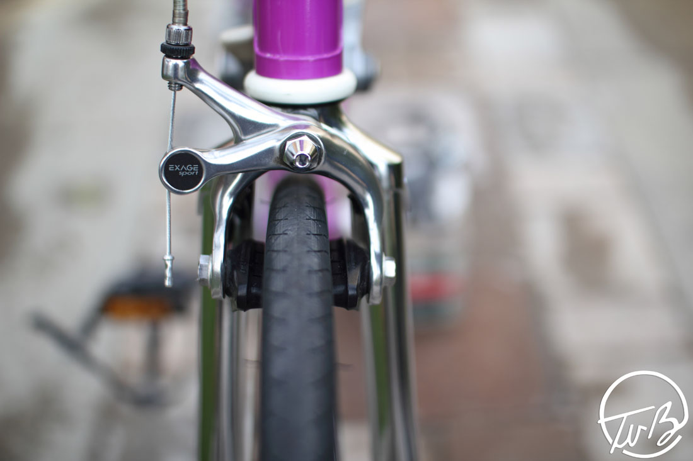
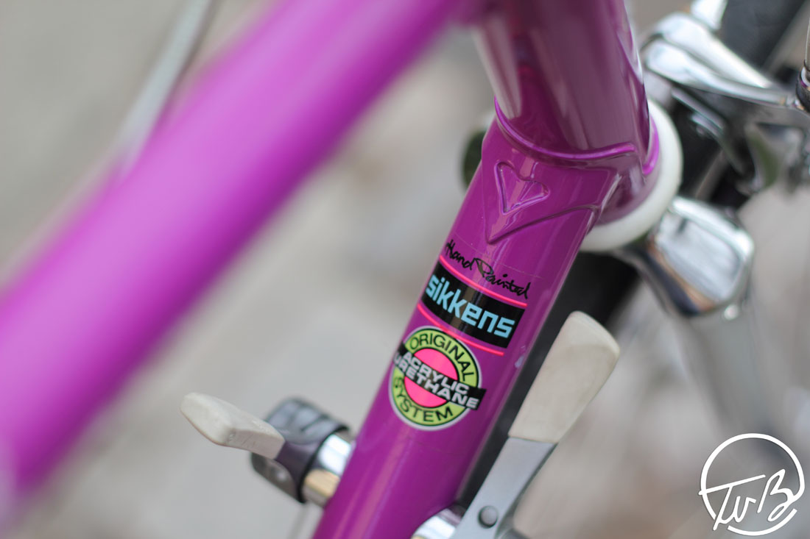
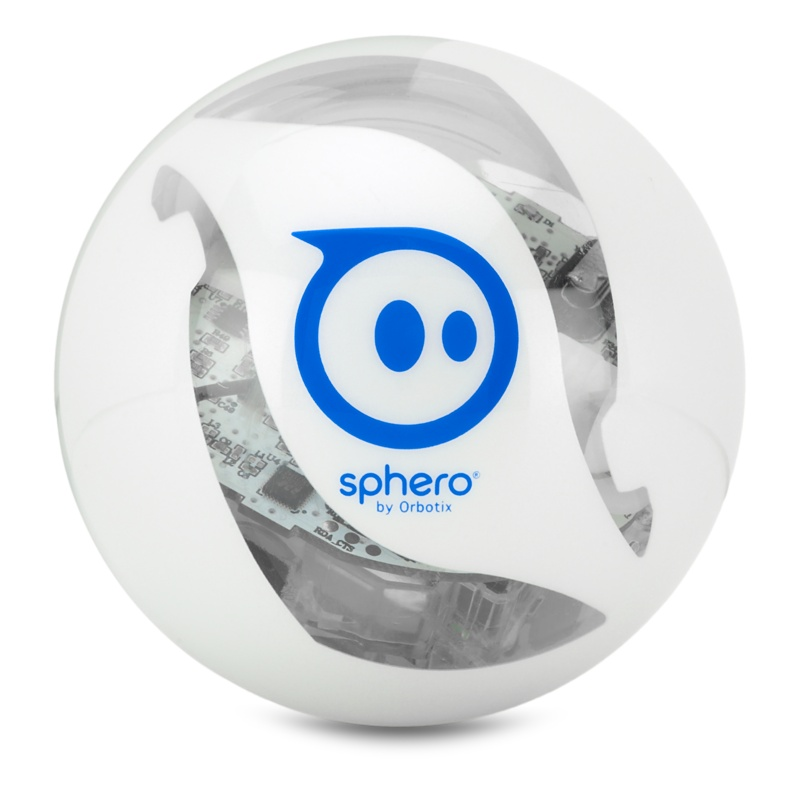

# css 

Целевая страница (landing page, также «посадочная страница»)
============================================================
веб-страница, построенная определенным образом, основной задачей которой является сбор контактных данных целевой аудитории. Используется для усиления эффективности рекламы, увеличения аудитории. Целевая страница обычно содержит информацию о товаре или услуге.
Переход на целевые страницы часто осуществляется из социальных медиа, email-рассылок и рекламных кампаний в поисковых системах. Главной задачей таких страниц является конвертация посетителя в покупателя или клиента компании, побуждение к целевому действию. Анализ действий пользователей на целевой странице позволяет маркетологам определить успешность рекламы.

Существует четыре основных типа целевых страниц:
------------------------------------------------
- автономная целевая страница
- микросайт
- главный сайт
- страница сегментации

Автономная целевая страница
---------------------------
CTR-целевые страницы (Clickthrough rate) — наиболее популярный тип целевых страниц. Представляет собой развернутое рекламное предложение. Основной задачей является побуждение пользователя к действию прямо сейчас — покупка, подписка на услуги или новости компании, загрузка пробной версии программного обеспечения и т. д.
Для усиления эффекта используются побуждающие и призывающие к действию слоганы, яркие и крупные кнопки, минималистичный дизайн, акценты на основных преимуществах предложения, таймеры обратного отсчета.
Микросайт
---------
Это отдельный сайт с информацией о рекламируемой услуге или товаре, состоящий из нескольких страниц (чаще всего не более 5). Обычно микросайты содержат минимум текстовой информации, большое количество привлекательных и красивых изображений товара или услуги, видео-ролики. Подобный тип целевых страниц часто используется крупными компаниями для рекламы отдельных проектов.
Главный сайт
------------
В качестве целевой страницы используется одна или несколько страниц основного сайта. Такая технология обладает достаточно низкой эффективностью, так как в дизайне основного сайта много отвлекающих внимание элементов навигации. Но позволяет сочетать более высокую конверсию, по сравнению с обычной страницей плюс удобность для SEO, сравнимую с обычным сайтом.
Лендо-сайт
----------
Сайт состоящий полностью из автономных целевых страниц. Обладает очень высокой конверсией, но в отличие от всех остальных видов, не удобен для SEO оптимизации.

1.html layout
-------------
```

<!DOCTYPE html>
<html class=''>

<head>
  <meta charset='UTF-8'>
  <meta http-equiv="X-UA-Compatible" content="IE=edge">
  <meta name="viewport" content="width=device-width, initial-scale=1">
    
  <meta name="title" content="">
  <meta name="description" content="">
  <meta name="author" content="">
  <meta name="keywords" content="">
  
  <title>Beauty Landing Page</title>
  <link rel="shortcut icon" href="favicon.ico" type="image/x-icon">
  <link rel='stylesheet prefetch' href='css/normalize.css'>
  <style>

  </style>
</head>

<body>

  <header>
    <h1><span>Beauty</span>Landing Page</h1>
    <h2>Morbi leo risus, porta ac consectetur ac, vestibulum at eros. Maecenas faucibus mollis interdum. Curabitur blandit tempus porttitor.</h2>
  </header>


  <section>
    <h2><span>About</span> Us</h2>
    <h3>Morbi leo risus, porta ac consectetur ac, vestibulum at eros. Maecenas faucibus mollis interdum. Curabitur blandit tempus porttitor.</h3>
  </section>

  <section>
    <div class="wrapper">
      
      <h2 class="">SOME TITLE</h2>
      <p class="">
        Morbi leo risus, porta ac consectetur ac, vestibulum at eros. Maecenas faucibus mollis interdum. Curabitur blandit tempus porttitor.
      </p>
      <div class="">
        
        <article>
          <a href="#">
            <h3>Creative Idea</h3>
            <p>Duis neque leo cursus ac libero ac imperdiet bibendum nisl mauris neque diam vulputate nem.</p><span>Read more</span>
          </a>
        </article>
        
        <article>
          <a href="#">
            <h3>Clean Code</h3>
            <p>Duis neque leo cursus ac libero ac imperdiet bibendum nisl mauris neque diam vulputate nem.</p><span>Read more</span></a>
        </article>
        
        <article>
          <a href="#">
            <h3>Mobile First</h3>
            <p>Duis neque leo cursus ac libero ac imperdiet bibendum nisl mauris neque diam vulputate nem.</p><span>Read more</span>
          </a>
        </article>
      
      </div>
    </div>
  </section>

  <section>
    <div class="wrapper">
      <h2>SOME TITLE</h2>
      <p>Morbi leo risus, porta ac consectetur ac, vestibulum at eros. Maecenas faucibus mollis interdum. Curabitur blandit tempus porttitor.</p><a href="#">TEXT BUTTON</a>
    </div>
  </section>

  <section>
    <div class="wrapper">
      <h2>SOME TITLE</h2>
      <p>Morbi leo risus, porta ac consectetur ac, vestibulum at eros. Maecenas faucibus mollis interdum. Curabitur blandit tempus porttitor.</p><a href="#">TEXT BUTTON</a>
    </div>
  </section>

  <section>
    <div class="wrapper">
      <h2>SOME TITLE</h2>
      <p>Morbi leo risus, porta ac consectetur ac, vestibulum at eros. Maecenas faucibus mollis interdum. Curabitur blandit tempus porttitor.</p><a href="#">TEXT BUTTON</a>
    </div>
  </section>

  <section>
    <div class="wrapper">
      <h2>SOME TITLE</h2>
      <p>Morbi leo risus, porta ac consectetur ac, vestibulum at eros. Maecenas faucibus mollis interdum. Curabitur blandit tempus porttitor.</p><a href="#">TEXT BUTTON</a>
    </div>
  </section>

  <footer>
    <p>&copy; 2016 Landing Page</p>
  </footer>


</body>
</html>
```
Modernizr
==========
https://modernizr.com/
----------------------
Modernizr - библиотека на JavaScript с открытым исходным кодом, позволяющая определять поддержку различных свойств . Modernizr предоставляет широкий спектр решений для веб-дизайнеров и разработчиков, чтобы пользоваться новыми возможностями HTML5 и CSS3, несмотря на различную поддержку браузерами.

Установка Modernizr
-------------------
Доступны два варианта для скачивания, либо полная версия Modernizr, либо создание пользовательской версии, которая будет включать в себя только те функции, которые вы собираетесь использовать. Поскольку эту библиотеку необходимо размещать в начале страницы, лучше осуществлять ручную настройку при скачивании. 

Чтобы установить Modernizr необходимо добавить скрипт для каждой страницы, которая будет его использовать. Вот основной документ HTML5:
```
<meta charset="utf-8">
<title>Hello Modernizr</title>
<script src="js/modernizr.js"></script> 
```
Этот скрипт надо загружать именно в head документа, а не в нижней части страницы, где обычно располагаются скрипты для осуществления большей производительности. Для правильной работы modernizr.js располагаем в секции head.

Ввод классов в HTML с помощью Modernizr
---------------------------------------
В разметке тегу html присвоен класс “no-js”. Во время загрузки страницы Modernizr заменит этот класс на “js”. Затем, вместе с классом js библиотека добавит классы для всех функций, которые браузер поддерживает, а также классы функций, которые браузер не поддерживает.

Например, вот как выглядит тег html для текущей версии Chrome:
```
<НTML class="js no-touch postmessage history multiplebgs boxshadow opacity cssanimations csscolumns cssgradients csstransforms csstransitions fontface localstorage sessionstorage svg inlinesvg blobbuilder blob bloburls download formdata">
```
А вот как выглядит этот тег для браузера Internet Explorer 7:
```
  <НTML class="js no-touch postmessage no-history no-multiplebgs no-boxshadow no-opacity no-cssanimations no-csscolumns no-cssgradients no-csstransforms no-csstransitions fontface localstorage sessionstorage no-svg no-inlinesvg wf-loading no-blobbuilder no-blob no-bloburls no-download no-formdata">
```
Вы можете использовать эти классы в CSS для создания специфических стилей для браузеров не поддерживающих какие-либо новый свойства. Например, вы хотите придать стиль кнопке с частичной прозрачностью:
```
  .button {
    background: #000;
    opacity: 0.75;
 }
```
Если браузер не поддерживает CSS свойство opacity, кнопка отобразится с чёрным фоном вместо серого полупрозрачного.

Используя класс добавленный modernizr, можно переопределить начальный стиль:
```
  .no-opacity .button {
    background: #444;
 }
```
Вы также можете сначала задать стиль для старых браузеров, а потом для браузеров с поддержкой opacity:
```
 .button {
    background: #444;
 }
.opacity .button {
    background: #000;
    opacity: 0.75;
 }
```
Также всегда стоит проверять, как выглядит тот или иной стиль, если javascript отключен.

Использование Shims и Polyfills
-------------------------------
Вы можете использовать Modernizr.load() чтобы ”пропатчить” браузер с помощью shims (это кусочки кода, которые имитируют отсутствие функциональности браузера) и polyfills (определённые классы shims, которые служат для репликации недостающей функциональности). Таким образом, если shim или polyfill для функции доступны, вы можете исправить любые недостающие функции в браузере пользователя, если, например, клиент потребует, чтобы внешний вид и функциональность была максимально одинаковый во всех браузерах.
Работа Modernizr с Internet Explorer
------------------------------------
В помощь к бибилиотеке html5shim в работе с IE, Modernizr также обеспечивает набор условных классов. Эти классы позволяют устанавливать CSS правила, которые ориентированы на конкретные версии IE. Для вызова классов для IE достаточно разместить перед html такой код:
```
 <!--[if lt IE 7]>     <html class="no-js ie lt-ie9 lt-ie8 lt-ie7"> <![endif]-->
 <!--[if IE 7]>        <html class="no-js ie lt-ie9 lt-ie8"> <![endif]-->
 <!--[if IE 8]>        <html class="no-js ie lt-ie9">
  <![endif]-->
 <!--[if IE 9]>        <html class="no-js ie lt-ie10"> <![endif]-->
```
2.html
-------
```
<!DOCTYPE html>
<html class=''>

<head>
  <meta charset='UTF-8'>
  <meta http-equiv="X-UA-Compatible" content="IE=edge">
  <meta name="viewport" content="width=device-width, initial-scale=1">
    
  <meta name="title" content="">
  <meta name="description" content="">
  <meta name="author" content="">
  <meta name="keywords" content="">
  
  <title>Beauty Landing Page</title>
  <link rel="shortcut icon" href="favicon.ico" type="image/x-icon">
  
  <script src="js/modernizr.js"></script> 
  <link rel='stylesheet prefetch' href='css/normalize.css'>
  <style>

  </style>


 <!--[if lt IE 7]>     <html class="no-js ie lt-ie9 lt-ie8 lt-ie7"> <![endif]-->
 <!--[if IE 7]>        <html class="no-js ie lt-ie9 lt-ie8"> <![endif]-->
 <!--[if IE 8]>        <html class="no-js ie lt-ie9">
  <![endif]-->
 <!--[if IE 9]>        <html class="no-js ie lt-ie10"> <![endif]-->

</head>
```

3.html box-sizing
-----------------
Применяется для изменения алгоритма расчета ширины и высоты элемента.

Согласно спецификации CSS ширина блока складывается из ширины контента (width), значений отступов (margin), полей (padding) и границ (border). Аналогично обстоит и с высотой блока. Свойство box-sizing позволяет изменить этот алгоритм, чтобы свойства width и height задавали размеры не контента, а размеры блока.
```
box-sizing: content-box | border-box | padding-box | inherit
```
content-box
-----------
Основывается на стандартах CSS, при этом свойства width и height задают ширину и высоту контента и не включают в себя значения отступов, полей и границ.
border-box
----------
Свойства width и height включают в себя значения полей и границ, но не отступов (margin). Эта модель используется браузером Internet Exporer в режиме несовместимости.
padding-box
-----------
Свойства width и height включают в себя значения полей, но не отступов (margin) и границ (border).
inherit
```
* {
  box-sizing: border-box;
}

```
main.css
---------
```
/* Glogal settings */

* {
  box-sizing: border-box;
}

a {
  text-decoration: none;
  -webkit-transition: all .3s ease;
  transition: all .3s ease;
}

body {
  font-family: "Merriweather", serif;
  font-size: 16px;
  line-height: 1.5;
}

footer {
  color: #fff;
  text-align: center;
  padding: 10px 0;
  background: #3b3b58;
}

footer p {
  opacity: .65;
}

.wrapper {
  margin: 0 auto;
  width: 96%;
  max-width: 1120px;
}

```
button
-------
```
<section>
    <div class="wrapper">
      <h2>SOME TITLE</h2>
      <p>Morbi leo risus, porta ac consectetur ac, vestibulum at eros. Maecenas faucibus mollis interdum. Curabitur blandit tempus porttitor.</p><a href="#" class="button">TEXT BUTTON</a>
    </div>
  </section>
```
css
---
```
.button {
  color: #fff;
  font-family: "Montserrat", sans-serif;
  text-align: center;
  display: block;
  margin: 0 auto;
  max-width: 300px;
  padding: 12px 18px;
  border-radius: 100px;
  background: #ff4e5c;
}

.button:hover {
  background: #ff3545;
}
```
4.html box - display: flex
---------------------------
```
        <article class="box">
          <a href="#">
            <h3>Creative Idea</h3>
            <p>Duis neque leo cursus ac libero ac imperdiet bibendum nisl mauris neque diam vulputate nem.</p><span>Read more</span>
          </a>
        </article>
```


БЭМ (Блок-Элемент-Модификатор)
==============================
методология web-разработки, а также набор интерфейсных библиотек, фреймворков и вспомогательных инструментов.

«Блок», «элемент» и «модификатор» — основные термины БЭМ. 
Это необходимые и достаточные понятия для описания интерфейса любой сложности.

Блок
====
Блок — это независимый интерфейсный компонент. Блок может быть простым или составным (содержать другие блоки). При создании блока нужно обеспечивать возможность его использования в любом месте web-страницы, а также повторения на той же самой странице. Блок должен включать в себя всю реализацию, необходимую для представления части интерфейса, которую он выражает.

Элемент
=======
Элемент — это составная часть блока. Элементы контекстно-зависимы: они имеют смысл только в рамках своего блока. Элемент — не обязательная составляющая блока, небольшие блоки обходятся без элементов.


Модификатор
===========
Модификатор — это свойство блока или элемента, задающее изменения в их внешнем виде или поведении. Модификатор может быть булевым (например, button_big) или парой ключ-значение (например, menu_type_bullet, menu_type_numbers). У блока или элемента может быть несколько модификаторов одновременно.

БЭМ предлагает общую семантическую модель для всех технологий, использующихся во фронтэнд разработке (HTML, CSS, JavaScript, шаблоны и др.)
Используя понятия «блок», «элемент» и «модификатор» можно описать древовидную структуру документа. Такое описание называется BEM tree и является семантическим представлением интерфейса, абстракцией над DOM tree.

HTML/CSS
========
В HTML/CSS блоки, элементы и модификаторы представлены в виде CSS-классов, названных согласно правилам именования (naming convention). Несколько блоков могут быть расположены на одном и том же DOM-узле, в этом случае DOM-узлу назначается 2 CSS-класса. На одном DOM-узле также могут быть одновременно расположены блок и элемент другого блока.

Правила именования БЭМ-классов
==============================
CSS-класс блока соответствует имени блока. Для разделения слов в сложных именах блоков используется дефис.
```
<article class="box"> </article>

<section class='section'> </section>
```
css
----
```
  .box {
      display: -webkit-box;
      display: -webkit-flex;
      display: -ms-flexbox;
      display: flex;
      -webkit-box-flex: 1;
      -webkit-flex: 1 0 100%;
          -ms-flex: 1 0 100%;
              flex: 1 0 100%;
      margin-bottom: 20px;
      background: #f9f9f9;
    }
```

CSS-класс элемента содержит имя блока и имя элемента, разделенные двумя знаками underscore.
```
        <article class="box">
          <a href="#" class="box__content">
            <h3 class="box__title">Creative Idea</h3>
            <p>Duis neque leo cursus ac libero ac imperdiet bibendum nisl mauris neque diam vulputate nem.</p><span class="box__more">Read more</span>
          </a>
        </article>
```
css
----
```
  .box__title {
      font-family: "Montserrat", sans-serif;
    }
    .box__more {
      color: #ff4e5c;
    }
    .box__content {
      color: #454545;
      text-align: center;
      padding: 20px;
    }
```
CSS-класс модификатора содержит имя блока и имя модификатора, разделенные одним знаком underscore. В том случае, если модификатор — это пара ключ-значение, они тоже разделяются знаком underscore. Для модификатора элемента в CSS-классе сохраняются и имя блока, и имя элемента. CSS-класс модификатора используется в паре с классом своего блока (или элемента).
```
<div class="header header_christmas">...</div> <!-- Christmas edition of the header -->

<ul class="menu">
    <li class="menu__item menu__item_current">...</li>
</ul>

<span class="button button_theme_night">...</span>

<div class="tabbed-pane tabbed-pane_disabled">...</div>
```

Альтернативные правила именования были предложены Гарри Робертсом. Он советует использовать 2 дефиса для разделения имён блока и модификатора.
```
<div class="header header--christmas">...</div> <!-- Christmas edition of the header -->

<ul class="menu">
    <li class="menu__item menu__item--current">...</li>
</ul>

<span class="button button--theme-night">...</span>

<div class="tabbed-pane tabbed-pane--disabled">...</div>
```
Префиксы
========
Некоторые правила именования рекомендуют использовать префиксы. Так, все классы блоков могут начинаться с префикса b-.
```
<div class="b-header">...</div>

<ul class="b-menu">...</ul>

<span class="b-button">...</span>

<div class="b-tabbed-pane">...</div>
```
Иногда в качестве префикса используют сокращенное имя проекта. Например, OraanjePool-> op.
```
<div class="op-header">...</div>

<ul class="op-menu">...</ul>

<span class="op-button">...</span>

<div class="op-tabbed-pane">...</div>
```
5.html section
----------------
```
  <section class='section'>
    <div class="wrapper">
      <h2 class="section__title">OUR FEATURES</h2>
      <p class="section__intro">
        Morbi leo risus, porta ac consectetur ac, vestibulum at eros. Maecenas faucibus mollis interdum. Curabitur blandit tempus porttitor.
      </p>
```
css
---
```
    .section {
      padding: 60px 0;
    }

    .section__title {
      font-size: 24px;
      color: #3b3b58;
      text-align: center;
      font-family: "Montserrat", sans-serif;
      margin: 14px 0;
    }
    .section__intro {
      display: block;
      text-align: center;
      margin: 0 5% 30px;
    }
```
6.html grid
------------
```
<section class='section'>
    <div class="wrapper">
      
      <h2 class="section__title">OUR FEATURES</h2>
      <p class="section__intro">
        Morbi leo risus, porta ac consectetur ac, vestibulum at eros. Maecenas faucibus mollis interdum. Curabitur blandit tempus porttitor.
      </p>
      <div class="section__grid">
        
        <article class="box">
          <a href="#" class="box__content">
            <h3 class="box__title">Creative Idea</h3>
            <p>Duis neque leo cursus ac libero ac imperdiet bibendum nisl mauris neque diam vulputate nem.</p><span class="box__more">Read more</span>
          </a>
        </article>
```

min-width
==========
Устанавливает минимальную ширину элемента. Если окно браузера по ширине становится меньше заданной минимальной ширины элемента, то ширина элемента остается неизменной, а в окне появляется горизонтальная полоса прокрутки.

Значение ширины элемента будет вычисляться в зависимости от установленных значений свойств width, max-width и min-width. 

Если значение ширины (width) меньше значения min-width, то ширина элемента принимается равной min-width.

В качестве значений принимаются пикселы (px), проценты (%) и другие единицы измерения, принятые в CSS. Отрицательные значения не допускаются. inherit наследует значение родителя.

css
---
```
    .section__grid {
      display: -webkit-box;
      display: -webkit-flex;
      display: -ms-flexbox;
      display: flex;
      -webkit-flex-wrap: wrap;
          -ms-flex-wrap: wrap;
              flex-wrap: wrap;
      -webkit-box-pack: justify;
      -webkit-justify-content: space-between;
          -ms-flex-pack: justify;
              justify-content: space-between;
    }

    @media only screen and (min-width: 43.75em) {
      .box {
        -webkit-box-flex: 0;
        -webkit-flex: 0 0 30%;
            -ms-flex: 0 0 30%;
                flex: 0 0 30%;
      }
    }
```
7.html header
--------------
```
header {
  text-align: center;
  position: relative;
  height: auto;
  padding-bottom: 80px;
  background: #4f2f60 url("images/header.jpg") center top no-repeat;
  background-size: cover;
  color: #fff;
  overflow: hidden;
}
header h1 {
  margin: 50px 0 20px;
  font-family: "Montserrat", sans-serif;
  font-size: 35px;
}
header h1 span {
  font: 700 60px/1 "Dancing Script", cursive;
  display: block;
}
header h2 {
  margin-left: auto;
  margin-right: auto;
  font-size: 1em;
  font-weight: 400;
  padding: 20px;
}
```
8.html
-------
```
  <section class = 'section section_cta'>
    <div class="wrapper">
      <h2 class="section__title">SOME TITLE</h2>
      <p class="section__intro">Morbi leo risus, porta ac consectetur ac, vestibulum at eros. Maecenas faucibus mollis interdum. Curabitur blandit tempus porttitor.</p><a href="#" class="button">TEXT BUTTON</a>
    </div>
  </section>

```
css
---
```
.section_cta {
      color: #454545;
      background: #f1f1f1;
    }

```

contact
--------
```
<link rel='stylesheet prefetch' href='http://weloveiconfonts.com/api/?family=zocial'>

  <section class="contact section_cta">
    <div class="contact__inner">
      <h2 class='contact__title'>{CONTACT} <span>ME</span></h2>
      
      <nav class='contact__nav'>
      <ul>
        <li><a href="#">T</a></li>
        <li><a href="#">s</a></li>
        <li><a href="#">g</a></li>
        <li><a href="#">+</a></li>
        <li><a href="#">R</a></li>
      </ul>
    </nav>
    </div>
  </section>
```
css
---
```
@import url(https://fonts.googleapis.com/css?family=Source+Sans+Pro:300);
  .section_cta {
      color: #454545;
      background: #f1f1f1;
    }

  .contact {
    
    width: 100%;
    height: auto;
    display: table;
    }
  
  .contact__inner {
    display: table-cell;
    vertical-align: middle;
    }
  
  .contact__title {
      text-align: center;
      font-size: 48px;
      font-weight: 300;
      letter-spacing: 0.1618em;
      line-height: 2.618em;
    }

  .contact__nav {
  text-align: center;
  }

  .contact__nav ul, li, a {
    display: inline-block;
  }

  .contact__nav li {
    border-right: 1px solid #DDD;
    padding: 5px 7px 5px 5px;
  }

  .contact__nav li:last-child {
    border-right-color: transparent;
  }

  .contact__nav a {
    width: 64px;
    height: 64px;
    line-height: 64px;
    text-decoration: none;
    color: #111;
    font-family: "zocial", sans-serif;
    font-size: 24px;
    border-radius: 50%;
    -moz-transition: background-color 0.15s ease-in-out;
    -o-transition: background-color 0.15s ease-in-out;
    -webkit-transition: background-color 0.15s ease-in-out;
    transition: background-color 0.15s ease-in-out;
  }

  .contact__nav a:hover {
    background-color: #ff4e5c;
    border-radius: 50%;
  }

  .contact__nav a:active {
    background-color: #ff1e5c;
    border-radius: 50%;
  }

```
9.html OUR FEATURES
--------------------
```
<link rel="stylesheet" href="https://maxcdn.bootstrapcdn.com/font-awesome/4.5.0/css/font-awesome.min.css">

       <article class="box">
          <a href="#" class="box__content"><i class="fa fa-lightbulb-o fa-3x"></i>
            <h3 class="box__title">Creative Idea</h3>
            <p>Duis neque leo cursus ac libero ac imperdiet bibendum nisl mauris neque diam vulputate nem.</p><span class="box__more">Read more <i class="fa fa-arrow-right"></i></span>
          </a>
        </article>
        
        <article class="box">
          <a href="#" class="box__content"><i class="fa fa-code fa-3x"></i>
            <h3 class="box__title">Clean Code</h3>
            <p>Duis neque leo cursus ac libero ac imperdiet bibendum nisl mauris neque diam vulputate nem.</p><span class="box__more">Read more <i class="fa fa-arrow-right"></i></span></a>
        </article>
        
        <article class="box">
          <a href="#" class="box__content"><i class="fa fa-mobile fa-3x"></i>
            <h3 class="box__title">Mobile First</h3>
            <p>Duis neque leo cursus ac libero ac imperdiet bibendum nisl mauris neque diam vulputate nem.</p><span class="box__more">Read more <i class="fa fa-arrow-right"></i></span>
          </a>
        </article>
```

css
---
```

  .box__content > i {
    color: #3b3b58;
  }

  .box__content:hover .box__more i {
    padding-left: 4px;
    -webkit-transition: all .2s ease-in-out;
    transition: all .2s ease-in-out;
  }

```

10.html CSS Responsive Image gallery
-------------------------------------
```
 <section>
    <div class="wrapper">
      <h2 class="section__title">CSS Responsive Image gallery</h2>

    <p>A demonstration on how to quickly make a responsive image gallery with Susy using SCSS only. Switch to responsive design view to see the action happen. Only three different breakpoint are used in this demo.</p>

    <hr>
      <ul class="gallery">

      <li>
        <div class="imgwrap">
          <a href="#">
            
            <span class="imgmask"></span>
          </a>
        </div>
        <a href="#">
          <h2>Awesome</h2>
        </a>
      </li>

      <li>
        <div class="imgwrap">
          <a href="#">
            
            <span class="imgmask"></span>
          </a>
        </div>
        <a href="#">
          <h2>Amazing</h2>
        </a>
      </li>

      <li>
        <div class="imgwrap">
          <a href="#">
            
            <span class="imgmask"></span>
          </a>
        </div>
        <a href="#">
          <h2>Nice Pic</h2>
        </a>
      </li>

      <li>
        <div class="imgwrap">
          <a href="#">
            
            <span class="imgmask"></span>
          </a>
        </div>
        <a href="#">
          <h2>Sweet</h2>
        </a>
      </li>

      <li>
        <div class="imgwrap">
          <a href="#">
            
            <span class="imgmask"></span>
          </a>
        </div>
        <a href="#">
          <h2>Cute Image</h2>
        </a>
      </li>

      <li>
        <div class="imgwrap">
          <a href="#">
            
            <span class="imgmask"></span>
          </a>
        </div>
        <a href="#">
          <h2>Excellent</h2>
        </a>
      </li>

      <li>
        <div class="imgwrap">
          <a href="#">
            
            <span class="imgmask"></span>
          </a>
        </div>
        <a href="#">
          <h2>Tasty</h2>
        </a>
      </li>

      <li>
        <div class="imgwrap">
          <a href="#">
            
            <span class="imgmask"></span>
          </a>
        </div>
        <a href="#">
          <h2>Good Stuff</h2>
        </a>
      </li>

      <li>
        <div class="imgwrap">
          <a href="#">
            
            <span class="imgmask"></span>
          </a>
        </div>
        <a href="#">
          <h2>Pretty</h2>
        </a>
      </li>

      <li>
        <div class="imgwrap">
          <a href="#">
            
            <span class="imgmask"></span>
          </a>
        </div>
        <a href="#">
          <h2>Fine Art</h2>
        </a>
      </li>

      <li>
        <div class="imgwrap">
          <a href="#">
            
            <span class="imgmask"></span>
          </a>
        </div>
        <a href="#">
          <h2>Super Duper</h2>
        </a>
      </li>

      <li>
        <div class="imgwrap">
          <a href="#">
            
            <span class="imgmask"></span>
          </a>
        </div>
        <a href="#">
          <h2>Sexy Stuff</h2>
        </a>
      </li>
    </ul>

    </div>
  </section>
```
css
----
```
.gallery {
  margin: 0 auto;
  text-align: center;
  width: 100%;
}
.gallery li {
  width: 21.73913%;
  float: left;
  text-align: center;
  position: relative;
  margin-bottom: 4.34783%;
  display: inline-block;
}
.gallery li:nth-child(4n + 1) {
  margin-left: 0;
  margin-right: -100%;
  clear: both;
  margin-left: 0;
}
.gallery li:nth-child(4n + 2) {
  margin-left: 26.08696%;
  margin-right: -100%;
  clear: none;
}
.gallery li:nth-child(4n + 3) {
  margin-left: 52.17391%;
  margin-right: -100%;
  clear: none;
}
.gallery li:nth-child(4n + 4) {
  margin-left: 78.26087%;
  margin-right: -100%;
  clear: none;
}
@media (max-width: 48rem) {
  .gallery li {
    width: 30.43478%;
    float: left;
  }
  .gallery li:nth-child(3n + 1) {
    margin-left: 0;
    margin-right: -100%;
    clear: both;
    margin-left: 0;
  }
  .gallery li:nth-child(3n + 2) {
    margin-left: 34.78261%;
    margin-right: -100%;
    clear: none;
  }
  .gallery li:nth-child(3n + 3) {
    margin-left: 69.56522%;
    margin-right: -100%;
    clear: none;
  }
}
@media (max-width: 30rem) {
  .gallery li {
    width: 47.82609%;
    float: left;
  }
  .gallery li:nth-child(2n + 1) {
    margin-left: 0;
    margin-right: -100%;
    clear: both;
    margin-left: 0;
  }
  .gallery li:nth-child(2n + 2) {
    margin-left: 52.17391%;
    margin-right: -100%;
    clear: none;
  }
}
@media (max-width: 20rem) {
  .gallery li {
    width: 100%;
    float: left;
  }
  .gallery li:nth-child(1n + 1) {
    margin-left: 0;
    margin-right: -100%;
    clear: both;
    margin-left: 0;
  }
}
.gallery li h2 {
  color: #999;
  font-size: 13.5px;
  letter-spacing: 1px;
  margin-top: 2.17391%;
  text-transform: uppercase;
}
.gallery li .imgwrap {
  background-color: #fff;
  padding: 8px;
  position: relative;
  border-radius: 2px;
  box-shadow: 1px 1px 1px rgba(0, 0, 0, 0.1);
}
.gallery li .imgmask {
  background: url("https://upload.wikimedia.org/wikipedia/commons/thumb/c/ce/Plus_font_awesome.svg/2000px-Plus_font_awesome.svg.png") 50%/25px no-repeat;
  position: absolute;
  top: 0;
  right: 0;
  bottom: 0;
  left: 0;
  opacity: 0;
  z-index: 1;
  vertical-align: bottom;
  text-align: center;
  -webkit-transition: all .25s ease-out;
  transition: all .25s ease-out;
}
.gallery li img {
  width: 100%;
  vertical-align: top;
  -webkit-transition: all .25s ease-out;
  transition: all .25s ease-out;
}
@media (max-width: 20rem) {
  .gallery li img {
    width: 100%;
  }
}
.gallery li:hover img {
  opacity: 0;
  -webkit-transition: all .25s ease-out;
  transition: all .25s ease-out;
}
.gallery li:hover .imgmask {
  background: url("https://upload.wikimedia.org/wikipedia/commons/thumb/c/ce/Plus_font_awesome.svg/2000px-Plus_font_awesome.svg.png") 50%/85px no-repeat;
  opacity: 1;
  -webkit-transition: all .25s ease-out;
  transition: all .25s ease-out;
}

```
11.html
--------
```
  <header>
    <h1><span>Beauty</span>Landing Page</h1>
    <h2>Morbi leo risus, porta ac consectetur ac, vestibulum at eros. Maecenas faucibus mollis interdum. Curabitur blandit tempus porttitor.</h2>
    <a href="#" class="button button_transparent">Order yours now!</a>
  </header>

<section class='section'>
    <div class="wrapper">
    <h2 class="section__title"><span>ABOUT</span> US</h2>
    <div class="container">
    <div class="col-3 text--center">
      
    </div>
    <div class="col-7 details">
      <h3>Product is so awesome.</h3>
      <p>Lorem ipsum dolor sit amet, consectetur adipisicing elit. Facere temporibus omnis illum, officia. Architecto voluptatibus commodi voluptatem perspiciatis eos possimus, eius at molestias quaerat magnam? Odio qui quos ipsam natus.</p>
       <p>Lorem ipsum dolor sit amet, consectetur adipisicing elit. Facere temporibus omnis illum, officia. Architecto voluptatibus commodi voluptatem perspiciatis eos possimus, eius at molestias quaerat magnam? Odio qui quos ipsam natus.</p>
        <p>Lorem ipsum dolor sit amet, consectetur adipisicing elit. Facere temporibus omnis illum, officia. Architecto voluptatibus commodi voluptatem perspiciatis eos possimus, eius at molestias quaerat magnam? Odio qui quos ipsam natus.</p>
    </div>
  </div>


    <p class="section__intro">Morbi leo risus, porta ac consectetur ac, vestibulum at eros. Maecenas faucibus mollis interdum. Curabitur blandit tempus porttitor.</p>
    </div>
  </section>

```
css
---
```
img {
  max-width: 100%;
  }
  .col, .col-7, .col-3, .col-5 {
  margin: 0 1.5%;
  display: inline-block;
  vertical-align: top;
}

.col-7 {
  width: 64%;
}
@media (max-width: 43.75em) {
  .col-7 {
    width: 100%;
    margin: 0;
  }
}

.col-3 {
  width: 29%;
}
@media (max-width: 43.75em) {
  .col-3 {
    width: 100%;
    margin: 0;
  }
}

.col-5 {
  width: 30%;
}
@media (max-width: 34.375em) {
  .col-5 {
    width: 60%;
    margin: 0;
  }
}


```

12.html paralax
----------------
```
<section class="section--primary--alt bg-image bg-image-2">
    <div class="wrapper">
      <h2>Reasons to buy this product:</h2>
      <p>Morbi leo risus, porta ac consectetur ac, vestibulum at eros. Maecenas faucibus mollis interdum. Curabitur blandit tempus porttitor.</p><a href="#" class="button">TEXT BUTTON</a>

    <div class="col-5 text--left">
      <ul>
        <li>Its the best</li>
        <li>Its awesome</li>
        <li>It makes you happy</li>
        <li>It brings world peace</li>
        <li>Its free!</li>
      </ul>
    </div>
    <div class="col-5 text--left">
      <ul>
        <li>Its the best</li>
        <li>Its awesome</li>
        <li>It makes you happy</li>
        <li>It brings world peace</li>
        <li>Its free!</li>
      </ul>
    </div>

    <p>Morbi leo risus, porta ac consectetur ac, vestibulum at eros. Maecenas faucibus mollis interdum. Curabitur blandit tempus porttitor.</p><a href="#" class="button">TEXT BUTTON</a>

    <div class="col-5 text--left">
      <ul>
        <li>Its the best</li>
        <li>Its awesome</li>
        <li>It makes you happy</li>
        <li>It brings world peace</li>
        <li>Its free!</li>
      </ul>
    </div>
    <div class="col-5 text--left">
      <ul>
        <li>Its the best</li>
        <li>Its awesome</li>
        <li>It makes you happy</li>
        <li>It brings world peace</li>
        <li>Its free!</li>
      </ul>
    </div>

    </div>
  </section>
```
css
----
```
 section.section--primary {
  background: #007ece;
  color: #fff;
}
section.section--primary--alt {
  background: #27a4f4;
  color: #fff;
}
section.section--primary--light {
  background: rgba(0, 126, 206, 0.1);
}
section.section--grey {
  background: #1c262b;
  color: #fff;
}
section.section--grey--light {
  background: #29363e;
  color: #fff;
}
.text--center {
  text-align: center;
}

.text--left {
  text-align: left;
}

.bg-image {
  background: #007ece;
  text-align: center;
  position: relative;
  z-index: 1;
  overflow: hidden;
}
.bg-image:before {
  content: '';
  display: block;
  position: absolute;
  top: 0;
  bottom: 0;
  left: 0;
  right: 0;
  width: 100%;
  height: 100%;
  z-index: -1;
  background: #333 url("images/4.jpg") no-repeat top center;
  background-size: cover;
  background-attachment: fixed;
  -webkit-filter: blur(5px);
          filter: blur(5px);
  opacity: .8;
  -webkit-transform: scale(1.1);
          transform: scale(1.1);
}
.bg-image.bg-image-2:before {
  opacity: .6;
  background-image: url("images/1.jpg");
  background-position: center center;
}
```

